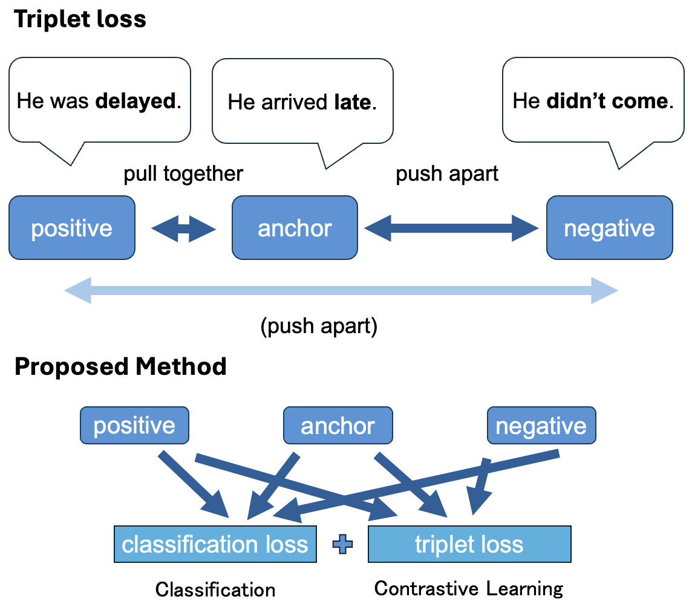

# LightHalluDetecter



## raw_rag_truth_dataset/
The raw data used for the experiment is included in the [RAGTruth dataset](https://github.com/ParticleMedia/RAGTruth) (Wu+, 2023).
The input text is described in `source_info.jsonl`, and the output text is described in `response.jsonl`.
## dataset/
The RAGTruth dataset was processed into a format compatible with this study.
Each dataset can be generated using `create_dataset.py` .
### rag_truth_{train, dev,test}.json
This is the dataset used for training/evaluating the detector.
In RAGTruth, train/test labels were assigned, but since there was no dev set, we randomly sampled from the train set to create the dev set.

Our method and compared methods predict `“labels”` with `‘ref’` and `“text”` as input.
| Field name| Field value | Description |
| --- | --- | --- |
| ref |String| Input text |
| text | String | Output text |
| labels | Int (0 or 1)| Label indicating whether the text contains hallucinations. If hallucinations are present, the label is 1; if not, it is 0. |
| source | String | The dataset containing the input text. If the “source_type” described below is “QA,” then it is ‘MARCO’ (MS MARCO, Nguyen+, 2016); if it is “Data2txt,” then it is “Yelp” (Yelp Open Dataset, Yelp, 2021), and if `"Summary"`, then `"CNN/DN"` (CNN/Daily Mail dataset See+, 2017) or `"Recent News"`.|
| model | String | The models used to generate the output text from the input text were `"gpt-4-0613" `, `"gpt-3.5-turbo-0613"`, `"mistral-7B-instruct"`, `"llama-2-7b-chat"`, `"llama-2-13b-chat"`, and `"llama-2-70b-chat"`. For each input text, output texts were generated using each of these six models. (There are six output texts for each input text.) |
| task_type | String | Tasks for generation. `"QA"` (question → answer), `"Data2txt"` (json text → natural text), and `"Summary"` (news before summarization → summarization) | 
|source_id | String | Unique ID assigned to each input sentence

```json
{
    "ref": "Andrew Getty, one of the heirs to billions of oil money, appears to have died of natural causes, a Los Angeles Police Department spokesman said. ...  People we've lost in 2015. CNN's Doug Criss, Janet DiGiacomo, Mark Mooney, Mike Love, Julie In and Cheri Mossburg contributed to this report.\n",
    "text": "Andrew Getty, oil tycoon J. Paul Getty's grandson, has died at the age of 47. ...  The Getty family fortune is estimated to be about $5 billion.",
    "labels": 0,
    "source": "CNN/DM",
    "model": "gpt-4-0613",
    "task_type": "Summary",
    "source_id": "15593"
}
```

### rag_truth_span_test.json
A more detailed dataset (testset) for analyzing our method.
It includes specific locations of hallucinations and metadata for each.
The added elements are shown below.
| Field name| Field value | Description |
| --- | --- | --- |
| hallucination_id | List\[Dict\] | `"start"` and `"end"` represent the start and end positions of the hallucinated span. `"text"` represents the extracted hallucinated span, and `"meta"` represents the annotator's description of the basis for the hallucination. `"label_type"` is the classification of hallucination types defined within RAGTruth, `"implict_true"` indicates whether the information is correct despite not being inferable from the input text, and `"due_to_null"` indicates whether the hallucination occurred due to the value being null in the Data-to-text task. |
| hallucination | Dict | `"hallucination_list"` is a list of hallucinated spans. |
```json
{
    "ref": "Andrew Getty, one of the heirs to billions of oil money, ... Julie In and Cheri Mossburg contributed to this report.\n",
    "text": "Andrew Getty, oil tycoon J. Paul Getty's grandson, ...  The Getty family fortune is estimated to be about $5 billion.",
    "labels": 1,
    "hallucination_id": [
        {
            "start": 280,
            "end": 327,
            "text": "His net worth was estimated to be $2.1 billion.",
            "meta": "EVIDENT CONFLICT:\nOriginal:  Gordon Getty whose net worth is stated as $2.1 billion.\nAIGC: Andrew Getty's net worth was estimated to be $2.1",
            "label_type": "Evident Conflict",
            "implicit_true": false,
            "due_to_null": false
        }
    ],
    "hallucination": {
        "hallucination_list": [
            "His net worth was estimated to be $2.1 billion."
        ]
    },
    "source": "CNN/DM",
    "model": "llama-2-13b-chat",
    "task_type": "Summary",
    "source_id": "15593"
}
```
## train_inference_code/
### models/models_{rob, phi}.py
`models_rob.py` describes Classifier and Proposed method when using RoBERTa as the base model, and `models_phi.py` describes each method when using phi-3.5-mini-instruct.

In the RoBERTa, which is encoder model, `pooler_output` is used to obtain output from the base model.
```python
text_output = self.base_model(input_ids=input_ids, attention_mask=attention_mask)[1]
```
In the phi-3.5-mini-instruct, which is decoder model, the output from the final layer for the final token is used to obtain the output from the base model.
```python
text_output = self.base_model(input_ids=input_ids, attention_mask=attention_mask)[0][:, -1, :] 
```
#### ClassifierModel
The input text and the output text are combined and input, and binary classification is used to determine whether the output text contains hallucinations.
The loss function does not use triplet loss, but only cross-entropy loss for classification.
#### TripletModel (Proposed method)
In addition to the training binary classification, contrastive learning using triplet loss is conducted.
During inference, combine the input text and output text and use binary classification to determine whether the output text contains hallucinations.

### prompt_gpt4o.ipynb
This method prompts GPT-4o to determine whether the output text contains hallucinations with 0-shot settings.
The results are saved in `results.json`.
Please make `.env` file and set the `OPENAI_API_KEY` variable.
### prompt_phi3.5.ipynb
This method prompts phi-3.5-mini-instruct to determine whether the output text contains hallucinations with 0-shot settings.
The results are saved in `results.json`.
### factscore.ipynb
This method uses [FActScore](https://github.com/shmsw25/FActScore) (Min+, 2023) to calculate the factual consistency score of the output text.
FActScore first decomposes the output text into a set of atomic facts and then evaluate the factual consistency of the output text by calculating the factual consistency score of each atomic fact based on the input text.
The results are saved in `results.json`.
This library is a bit old, so you will need to downgrade the version of some libraries.
Therefore, we reccomend using another virtual environment. (Please use `requirements_fs.txt`)
### classifier_{rob, phi}.ipynb
This method uses the ClassifierModel described in `models/models_{rob, phi}.py` to determine whether the output text contains hallucinations.
As a loss function, cross-entropy loss is used for binary classification.
The trained model will be saved in `trained_model` directory.
The results of inference are saved in `results.json`.
### triplet_{rob, phi}.ipynb
This method uses the TripletModel described in `models/models_{rob, phi}.py` to determine whether the output text contains hallucinations.
In addition to the training binary classification, contrastive learning using triplet loss is conducted.
The trained model will be saved in `trained_model` directory.
The results of inference are saved in `results.json`.

## analysis.ipynb
The results od inference will be saved in `results.json`.
This file analyzes the results of inference and compares the performance of each method.
```json
{
    "id": 0,
    "label": 1,
    "task": "Summary",
    "gpt4o": 1,
    "phi3.5": 0,
    "fs_score": 0.66666666,
    "fs_label": 0,
    "cls_rob_logits": [0.901037514, -0.383329033],
    "cls_rob_label": 0,
    "cls_phi_logits": [1.040211796, -0.133165389],
    "cls_phi_label": 0,
    "triplet_rob_logits": [-0.317776918, 0.423602402],
    "triplet_rob_label": 1,
    "triplet_phi_logits": [-0.564265549, 0.508678495],
    "triplet_phi_label": 1,
}
```

## Citaion 
Please cite our paper of you use our method:
```
@inproceedings{
yamada2025lightweight,
title={Light-Weight Hallucination Detection using Contrastive Learning for Conditional Text Generation},
author={Miyu Yamada and Yuki Arase},
booktitle={ACL 2025 Student Research Workshop},
year={2025},
url={https://openreview.net/forum?id=CHVMB2lTiB}
}
```